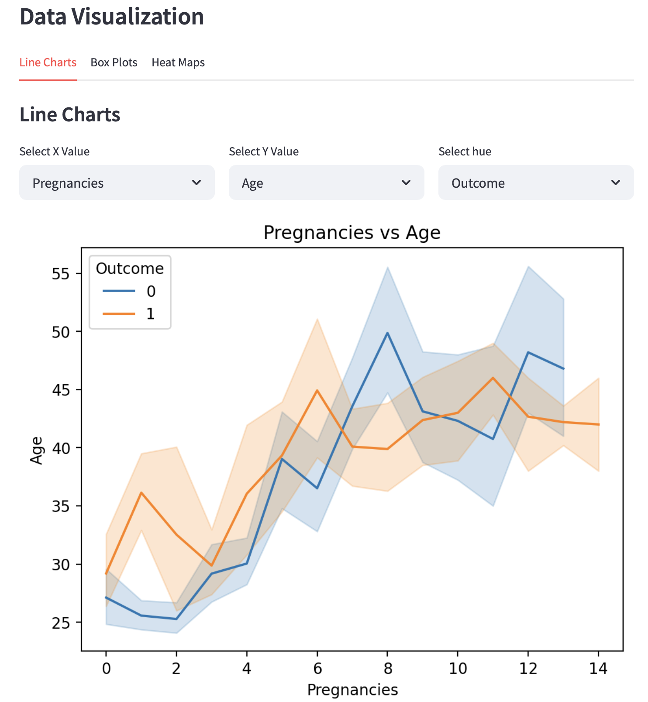
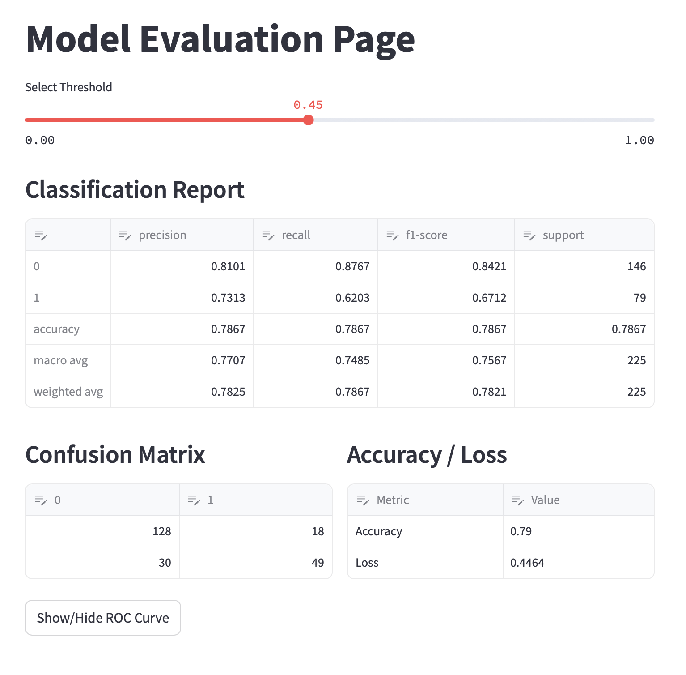

# Diabetes Prediction App

This is a Streamlit-based web application designed to predict the likelihood of diabetes in individuals based on diagnostic measurements. The app also provides tools for data exploration and model evaluation.

## Dataset

The dataset used in this project is sourced from the National Institute of Diabetes and Digestive and Kidney Diseases. It contains diagnostic measurements for predicting diabetes in Pima Indian women aged 21 or older. For more details, refer to the `Data/about_data.txt` file.

## Features

1. **Prediction Page**: 
   - Allows users to input diagnostic measurements and calculates the probability of diabetes.
   - Provides a binary prediction (Yes/No) based on the selected threshold.

2. **Data Exploration Page**:
   - Displays descriptive statistics of the dataset.
   - Provides interactive visualizations such as line charts and heatmaps to explore feature correlations.
    

3. **Model Evaluation Page**:
   - Displays model performance metrics, including classification reports, confusion matrices, and accuracy/loss values.
   - Visualizes the ROC curve for model evaluation.
    

4. **About Page**:
   - Provides an overview of the application, its purpose, and how it can be used.
   - Includes information about the dataset and the machine learning model used for predictions.

## Project Structure

```
diabetes_model.pkl
model_threshold.pkl
README.md
requirements.txt
.streamlit/
    config.toml
Data/
    diabetes.csv
    data_exploration.py
    kaggle_data_download.py
src/
    app.py
    data_exploration_page.py
    model_evaluation_page.py
    predictions_page.py
    models/
        logistic_model.py
        predictions.py
    utils/
        preprocessing.py
        helper.py
```

## Installation

1. Clone the repository:
   ```sh
   git clone <repository-url>
   cd diabetes_prediction_app
   ```

2. Install dependencies:
   ```sh
   pip install -r requirements.txt
   ```

3. Run the application:
   ```sh
   streamlit run src/app.py
   ```

## Usage

- Navigate to the **Prediction Page** to input diagnostic measurements and predict diabetes.
- Explore the dataset and its correlations on the **Data Exploration Page**.
- Evaluate the model's performance on the **Model Evaluation Page**.

## Dependencies

The project requires the following Python libraries:
- Streamlit
- Pandas
- NumPy
- Scikit-learn
- Matplotlib
- Seaborn

For a full list of dependencies, see the `requirements.txt` file.

## Acknowledgments

This project uses the Pima Indians Diabetes Database from the National Institute of Diabetes and Digestive and Kidney Diseases.

## License

This project is licensed under the MIT License. See the LICENSE file for details.
